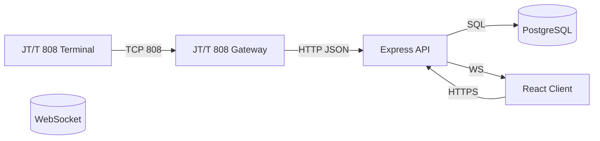

# Fleet Platform Architecture

- 设备终端通过 JT/T 808-2019 与接入网关通信。
- 接入网关将定位与告警转换为 HTTP 请求推送至后端。
- 后端 API 使用 TypeORM 持久化数据，并通过 Socket.IO 向前端推送实时事件。
- 前端 React 客户端消费 REST 与 WebSocket 接口，实现车队监控、轨迹回放与报表展示。
